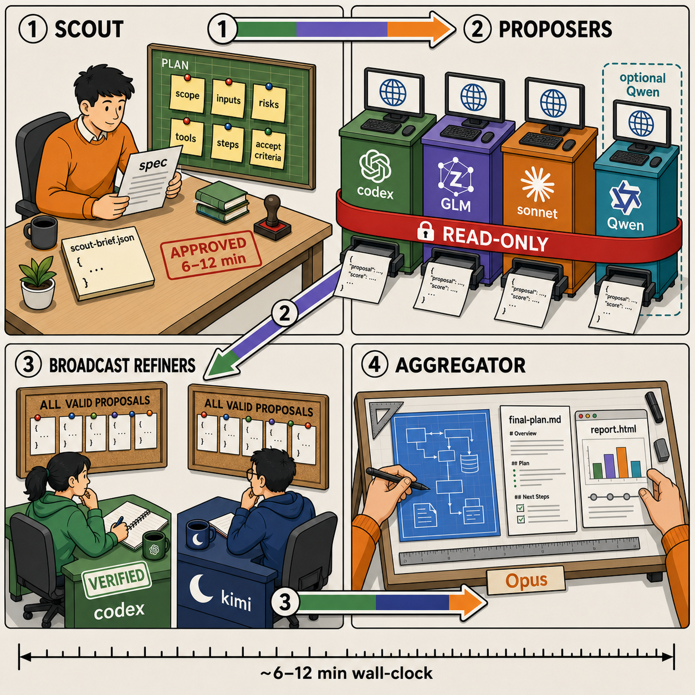

<p align="center">
  
</p>

<p align="center">
  
  
  
  
</p>

<p align="center">
  
</p>

A small, CLI-native take on the 2024
[Mixture-of-Agents paper](https://arxiv.org/abs/2406.04692), pointed at
a different job: producing **repo-grounded implementation plans** for
coding agents instead of chat answers. The default roster puts proposers
from three different labs to work — OpenAI `codex`, Zhipu `glm` (GLM-5.2 via
the `opencode` CLI), Anthropic `claude` Sonnet — reading the repo in
parallel, doing their own web research, and each writing an independent
plan. Two refiners (`codex` + Moonshot `kimi`) then refine in broadcast
mode (every refiner sees every plan). Finally a parent Claude Opus session
aggregates the whole thing into one plan you can act on.

Built to run **inside Claude Code** as a skill. Standalone Python works
too. The harness ships built-in providers across four harnesses (`codex`,
`claude`, `opencode`, `cursor`) and the roster — which providers run at
which layer, and how many — is pure config. API-based auth and more
providers are already supported. See "Contributions we'd prioritize" below
for the remaining gaps.

Qwen Cloud Token Plan is available as the optional built-in `qwen` provider
(`qwen-token-plan/qwen3.7-max` through OpenCode). Its dedicated `sk-sp-...`
key stays in `.env`; see [`docs/config.md`](docs/config.md#add-qwen-token-plan).

## TL;DR

```bash
# 1. Install the CLIs (see docs/install.md for details)
npm i -g @openai/codex               && codex login
curl -fsSL https://opencode.ai/install | bash   # then: opencode auth login,
                                                 # or export ZHIPU_API_KEY / MOONSHOT_API_KEY
# claude CLI: https://docs.claude.com/en/docs/claude-code/quickstart

# 2. Install as a Claude Code skill
cp -r harness ~/.claude/skills/mixture-of-agents

# 3. Inside Claude Code, in any project
/mixture-of-agents
```

## Architecture at a glance

```
Layer 0 — Scout brief           (parent Claude, in-place)
Layer 1 — Proposers (parallel)    default: codex + glm + sonnet subprocesses
Layer 2 — Broadcast refiners      default: codex + kimi, each sees ALL proposals
Layer 3 — Aggregator              (parent Claude Opus, in-place)
```

The roster is config-driven; the defaults above span four labs (OpenAI,
Zhipu, Anthropic, Moonshot) and keep the refiners independent of the Opus
aggregator's lab.

Every run also writes a self-contained `.moa/<session>/report.html` — a
zero-network visual post-mortem (3D pipeline, per-agent Gantt, proposer
plans, refiner verdict matrix, aggregated plan, raw logs). Open it in a
browser; details in [`docs/report.md`](docs/report.md).

Typical wall-clock is 6–12 minutes. Use it for non-trivial
architecture work, not one-line fixes. Background in
[`docs/architecture.md`](docs/architecture.md).

## Docs

- [`docs/install.md`](docs/install.md): install the CLIs, verify, install as a Claude Code skill
- [`docs/usage.md`](docs/usage.md): running via `/mixture-of-agents` (primary) or standalone
- [`docs/config.md`](docs/config.md): `.env` + `harness/config.yaml`, MOA_\* knob table, precedence, roster swaps
- [`docs/architecture.md`](docs/architecture.md): the four layers, why broadcast, why this roster
- [`docs/report.md`](docs/report.md): the self-contained HTML run report (`report.html`) — 3D pipeline, Gantt, verdict matrix
- [`CONTRIBUTING.md`](CONTRIBUTING.md): dev setup, PR protocol, where help is welcome
- [`SECURITY.md`](SECURITY.md): private vulnerability reports
- [`CLAUDE.md`](CLAUDE.md) / [`AGENTS.md`](AGENTS.md): guidance for coding agents working on this repo (AGENTS.md points at CLAUDE.md)

## Repo layout

```
README.md              this file
CLAUDE.md              agent guidance for this repo
AGENTS.md              pointer to CLAUDE.md for Codex / OpenCode / Cursor / Zed
CONTRIBUTING.md        contributor guide
SECURITY.md            vulnerability reporting
LICENSE                MIT
.env.example           copy to .env to override harness defaults
docs/                  longer-form docs by topic (+ brand images)
harness/               orchestrator, adapters, prompts, schemas
  SKILL.md             Claude Code skill manifest
  README.md            skill-internal notes (lives with harness/ when copied into ~/.claude/skills/)
  config.example.yaml  copy to harness/config.yaml to override defaults
  prompts/             scout / proposer / refiner / aggregator
  report/              HTML report template + vendored three.min.js
  scripts/             orchestrator + adapters + config + report + tests
requirements-cli.txt   install/auth notes for the provider CLIs
```

## Contributions we'd prioritize

The core roster, named-provider system, API-key auth paths, Qwen Token Plan,
phase checkpoints, and HTML reporting are now shipped. The highest-leverage
remaining contributions are:

- **A complete standalone host workflow.** `run_moa.py` handles the proposer
  and refiner layers from any shell, but Claude Code still supplies the scout
  and final aggregation steps. Add a first-class command that can create the
  scout brief, run every layer, write `final-plan.md`, and refresh
  `report.html` without a parent Claude Code session.
- **Usage, quota, and cost observability.** Capture the token/usage metadata
  each CLI exposes, normalize it into the manifest and HTML report, distinguish
  subscription from metered runs, and make unknown cost explicit. A safe
  budget control could stop later dispatches before a configured ceiling is
  exceeded; it must not pretend it can undo an already-billed request.
- **Defense-in-depth workspace immutability.** Codex uses a filesystem
  sandbox, Claude uses a read-only tool allowlist, Cursor uses `--mode plan`,
  and OpenCode denies edit and shell tools. Add a harness-independent
  before/after integrity check that detects tracked, untracked, and deleted
  files and marks any mutating agent as failed.
- **Tested provider recipes, not just model-name examples.** Qwen is already a
  built-in provider. Contributions for DeepSeek, MiniMax, xAI Grok, Mistral,
  or another credible coding model should include a reproducible config,
  credential preflight, captured parser fixtures, and an end-to-end smoke-test
  result. Most should use the existing OpenCode or Cursor adapter; discuss a
  genuinely new harness in an issue first.
- **CLI compatibility and recovery hardening.** Add version/capability probes,
  fixture-based coverage for real failure envelopes, clearer auth/quota/model
  diagnostics, and resumable recovery paths that avoid rerunning successful
  agents after an interrupted session.

API-key billing itself is no longer a missing feature: Codex supports API-key
login, Claude accepts `ANTHROPIC_API_KEY`, OpenCode routes provider keys, and
Cursor accepts `CURSOR_API_KEY`. The missing layer is normalized usage and cost
telemetry across those different billing modes.

See [`CONTRIBUTING.md`](CONTRIBUTING.md) for the PR protocol.

## Status

Active reference implementation, currently v0.4.0. The default four-lab roster
and optional Qwen proposer have been exercised end to end; offline CI covers
configuration, schemas, adapters, checkpoint recovery, and self-contained HTML
report generation. Contributions are welcome; see
[CONTRIBUTING.md](CONTRIBUTING.md). Security reports go through
[SECURITY.md](SECURITY.md).

## License

MIT; see [LICENSE](LICENSE). Copyright (c) 2026 Kyle Boddy.

## Author

Kyle Boddy.
