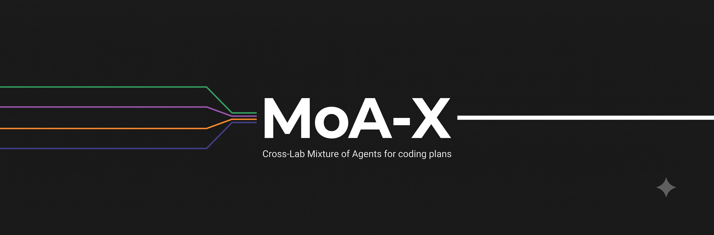
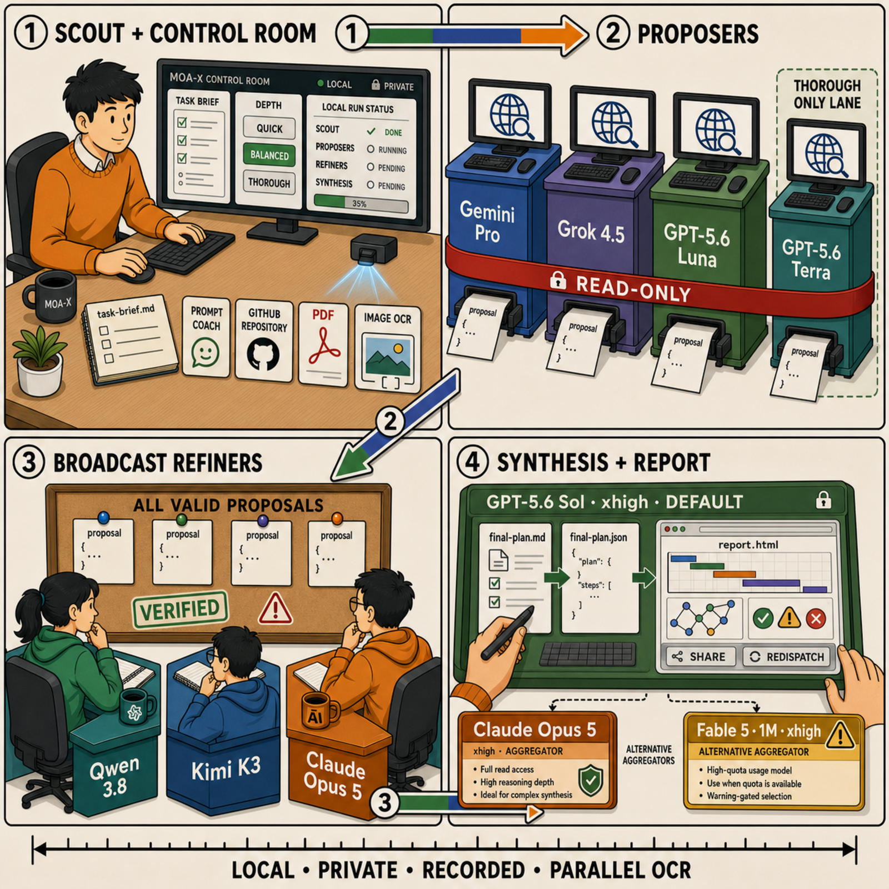

<p align="center">
  
</p>

<p align="center">
  
  
  
  
</p>

<p align="center">
  
</p>

A small, CLI-native take on the 2024
[Mixture-of-Agents paper](https://arxiv.org/abs/2406.04692), pointed at
a different job: producing **repo-grounded implementation plans** for
coding agents instead of chat answers. The default roster puts proposers
from three model labs to work — Google `agy-gemini-pro`
(`gemini-3.1-pro-high`), xAI `grok` (`opencode-go/grok-4.5`), and
OpenAI `codex-luna` (`gpt-5.6-luna`) — reading the repo in
parallel, doing their own web research, and each writing an independent
plan. Three refiners—Alibaba Qwen `qwen3.8-max-preview`, DeepSeek V4 Pro,
and Anthropic `claude-opus-5`—then refine in broadcast mode (every refiner
sees every plan). The shipped defaults and all recommended Web UI modes run Layer 3
through the recorded Codex path with `gpt-5.6-sol` at `xhigh` reasoning.
Claude Opus 5 is also available as an aggregator, while Fable 5 is available
only as a warning-gated, quota-heavy aggregator option.

Built to run **inside Claude Code** as a skill, or from the local Web UI.
Standalone Python works too. The harness ships curated routes across four
execution harnesses (`codex`, `claude`, `opencode`, `agy`) and the roster — which models run at
which layer, and how many — is pure config. API-based auth and more
providers are already supported. See "Contributions we'd prioritize" below
for the remaining gaps.

Qwen Cloud Token Plan powers the default `qwen` refiner
(`qwen-token-plan/qwen3.8-max-preview` through OpenCode). Its dedicated `sk-sp-...`
key stays in `.env`; see [`docs/config.md`](docs/config.md#add-qwen-token-plan).

## TL;DR

```bash
# 1. Install the CLIs (see docs/install.md for details)
npm i -g @openai/codex               && codex login
curl -fsSL https://opencode.ai/install | bash   # then: opencode auth login,
                                                 # or export MOONSHOT_API_KEY
# claude CLI: https://docs.claude.com/en/docs/claude-code/quickstart
# AGY/Antigravity: install/update Antigravity, run `agy install`, then sign in

# 2. Install as a Claude Code skill
cp -r harness ~/.claude/skills/mixture-of-agents

# 3. Inside Claude Code, in any project
/mixture-of-agents
```

## Local Web UI

The Flask control room queues runs, streams phase events, shows local provider
health, and indexes current and historical `.moa` sessions in SQLite. It uses
the same `HOME`, `PATH`, environment, and authenticated CLI accounts as the
server process; credentials are never copied into the browser or database.
Tasks can run without a repository and may include up to 10 durable local
file uploads (25 MB each). PDF, Markdown, common text formats, and locally
OCRed images are copied into an isolated run snapshot, converted into one
bounded Markdown context packet, and embedded in every proposer, refiner, and
aggregator prompt. Local
workspaces are optional. When repository context is useful, the GitHub picker
can shallow-clone only an explicitly allowed GitHub owner through the
machine's authenticated `gh` CLI. Browser-generated profile IDs
remain in `localStorage`; profile names/settings, jobs, events, and history are
retained in SQLite without adding a login system.

```bash
git clone https://github.com/drivelineresearch/moa-x.git
cd moa-x
python3 -m venv .venv
.venv/bin/pip install -r requirements-web.txt
MOA_WEBUI_GITHUB_OWNER=your-github-user-or-org \
  .venv/bin/python -m harness.webui
```

Open `http://localhost:7340`. There is no frontend compilation step: the
versioned HTML, CSS, JavaScript, and image assets are served directly by
Flask/Waitress. The safe default bind is `127.0.0.1`. To opt into trusted-LAN
access, set `MOA_WEBUI_HOST=0.0.0.0`; because the UI intentionally has no
login, never expose that listener directly to the public internet. Set
`MOA_WEBUI_PORT` to change the port and
`MOA_WEBUI_WORKSPACE_ROOTS` (colon-separated on Linux/macOS) to bound backend
path operations such as history import. New runs use Task only or an
allowlisted GitHub repository. See [`docs/webui.md`](docs/webui.md)
for clean-clone setup, Task-only storage, GitHub configuration, development,
and the HTTP surface.

AGY is the curated Google route and reuses the account already signed into
`agy`; its live model probe determines which Gemini routes are available.

## Architecture at a glance

```
Layer 0 — Scout brief           (parent Claude, in-place)
Layer 1 — Proposers (parallel)    default: Gemini Pro + Grok + GPT-5.6 Luna
Layer 2 — Broadcast refiners      default: Qwen + DeepSeek + Opus, each sees ALL proposals
Layer 3 — Aggregator              default: recorded GPT-5.6 Sol at xhigh
```

The roster is config-driven; every named route in the default pipeline comes
from a deliberately named lab: Google, xAI, OpenAI, Alibaba, DeepSeek, and
Anthropic. The UI groups and illustrates routes by model lab, independently
of the CLI used to execute them.

Every run also writes a self-contained `.moa/<session>/report.html` — a
zero-network visual post-mortem (3D pipeline, per-agent Gantt, proposer
plans, refiner verdict matrix, an evidence-weighted living decision map,
interactive final-step lineage, aggregated plan, and raw logs). Open it in a
browser; details in
[`docs/report.md`](docs/report.md).

Typical wall-clock is roughly 12–25 minutes for research-heavy work, with
provider latency determining the tail. Use it for non-trivial
architecture work, not one-line fixes. Background in
[`docs/architecture.md`](docs/architecture.md).

## Docs

- [`docs/install.md`](docs/install.md): install the CLIs, verify, install as a Claude Code skill
- [`docs/usage.md`](docs/usage.md): running via `/mixture-of-agents` (primary) or standalone
- [`docs/webui.md`](docs/webui.md): local control-room setup, persistence, uploads, GitHub workspaces, security
- [`docs/config.md`](docs/config.md): `.env` + `harness/config.yaml`, MOA_\* knob table, precedence, roster swaps
- [`docs/architecture.md`](docs/architecture.md): the four layers, why broadcast, why this roster
- [`docs/report.md`](docs/report.md): the self-contained HTML run report (`report.html`) — timeline, verdicts, evidence-weighted decision map, and exact lineage
- [`docs/assets.md`](docs/assets.md): asset provenance, font policy, animation sources, and contribution rules
- [`CONTRIBUTING.md`](CONTRIBUTING.md): dev setup, PR protocol, where help is welcome
- [`SECURITY.md`](SECURITY.md): private vulnerability reports
- [`CLAUDE.md`](CLAUDE.md) / [`AGENTS.md`](AGENTS.md): guidance for coding agents working on this repo (AGENTS.md points at CLAUDE.md)

## Repo layout

```
README.md              this file
CLAUDE.md              agent guidance for this repo
AGENTS.md              pointer to CLAUDE.md for coding agents
CONTRIBUTING.md        contributor guide
CHANGELOG.md           release notes
SECURITY.md            vulnerability reporting
LICENSE                MIT
.env.example           copy to .env to override harness defaults
docs/                  longer-form docs by topic (+ brand images)
harness/               orchestrator, adapters, prompts, schemas
  SKILL.md             Claude Code skill manifest
  README.md            skill-internal notes (lives with harness/ when copied into ~/.claude/skills/)
  config.example.yaml  copy to harness/config.yaml to override defaults
  prompts/             scout / proposer / refiner / aggregator
  report/              HTML report template + embedded illustration assets
  scripts/             orchestrator + adapters + deterministic decision map + report + tests
  webui/               Flask control plane, SQLite store, worker, and frontend
requirements-cli.txt   install/auth notes for the provider CLIs
requirements-web.txt   optional Flask control-room dependencies
```

## Contributions we'd prioritize

The core roster, named-provider system, API-key auth paths, Qwen Token Plan,
phase checkpoints, and HTML reporting are now shipped. The highest-leverage
remaining contributions are:

- **A CLI-only raw-spec convenience command.** The Web UI can create a job
  from a raw goal and drive every recorded phase. `run_moa.py` also handles
  the proposer/refiner layers and recorded Layer 3 from a shell. The remaining
  gap is a single non-Web CLI command that creates Layer 0 and drives all
  phases without a parent session.
- **Usage, quota, and cost observability.** Capture the token/usage metadata
  each CLI exposes, normalize it into the manifest and HTML report, distinguish
  subscription from metered runs, and make unknown cost explicit. A safe
  budget control could stop later dispatches before a configured ceiling is
  exceeded; it must not pretend it can undo an already-billed request.
- **Tested provider recipes, not just model-name examples.** Qwen Token Plan,
  OpenCode Go DeepSeek, GLM, and Grok routes are already built in.
  Contributions for MiniMax, Mistral,
  or another credible coding model should include a reproducible config,
  credential preflight, captured parser fixtures, and an end-to-end smoke-test
  result. Most should use the existing OpenCode adapter; discuss a
  genuinely new harness in an issue first.
- **CLI compatibility and recovery hardening.** Add version/capability probes,
  fixture-based coverage for real failure envelopes, clearer auth/quota/model
  diagnostics, and resumable recovery paths that avoid rerunning successful
  agents after an interrupted session.

API-key billing itself is no longer a missing feature: Codex supports API-key
login, Claude accepts `ANTHROPIC_API_KEY`, and OpenCode routes provider keys.
The missing layer is normalized usage and cost telemetry across those different
billing modes.

See [`CONTRIBUTING.md`](CONTRIBUTING.md) for the PR protocol.

## Status

Active reference implementation, currently v0.4.1. The default six-lab roster
and Qwen Token Plan route have been exercised end to end; offline CI covers
configuration, schemas, adapters, checkpoint recovery, recorded Layer 3, and
self-contained HTML report generation. Contributions are welcome; see
[CONTRIBUTING.md](CONTRIBUTING.md), and release notes are in
[CHANGELOG.md](CHANGELOG.md). Security reports go through
[SECURITY.md](SECURITY.md).

## License

MIT; see [LICENSE](LICENSE). Copyright (c) 2026 Kyle Boddy.

## Author

Kyle Boddy.

## Contributors

[](https://github.com/drivelineresearch/moa-x/graphs/contributors)

<p>
  <a href="https://github.com/kyleboddy"></a>
  <a href="https://github.com/mjfork"></a>
  <a href="https://github.com/joewilsonai"></a>
</p>
