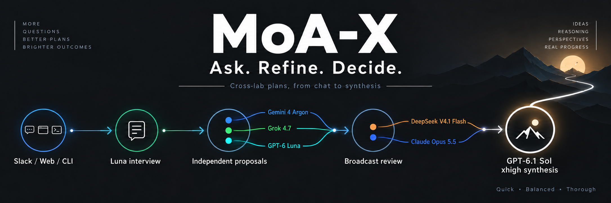

# MoA-X

<p align="center">
  
</p>

MoA-X turns a task into an implementation plan using models from different
labs. Independent proposers research the task, broadcast reviewers check every
proposal, and a recorded synthesis produces a plan with evidence, disagreements,
and an independent final check.

Use it through **Claude Code**, the **local Web UI**, or **Slack**. Repository
context is optional for web and Slack requests; both accept reference uploads.
Each run retains its outputs and a self-contained HTML report.

## Get started

Install and authenticate the provider CLIs in the [installation guide](docs/install.md).
The default roster needs Codex, Claude Code, AGY, and OpenCode.

```bash
git clone https://github.com/drivelineresearch/moa-x.git
cd moa-x
mkdir -p ~/.claude/skills
cp -r harness ~/.claude/skills/mixture-of-agents
python3 ~/.claude/skills/mixture-of-agents/scripts/install_deps.py
```

Inside Claude Code, run `/mixture-of-agents` and describe the task.
The skill previews the brief and asks before dispatching paid model calls.
See [usage](docs/usage.md) for the full workflow and standalone commands.

For the local Web UI:

```bash
python3 -m venv .venv
.venv/bin/pip install -r requirements-web.txt
MOA_WEBUI_GITHUB_OWNER=your-github-user-or-org \
  .venv/bin/python -m harness.webui
```

Open `http://localhost:7340`. The UI reuses the server user's authenticated
CLIs and has no login; keep the listener on localhost or a trusted network.
Follow [Web UI setup](docs/webui.md) or [Slack setup](docs/slack.md) for those interfaces.

## How it works

| Stage | Default CLI roster |
|---|---|
| Scout | Frozen request and bounded repository reconnaissance |
| Propose | Gemini 4 Argon, Grok 4.7, GPT-6 Luna |
| Review | DeepSeek V4.1 Flash and Claude Opus 5.5; each sees every proposal |
| Synthesize | GPT-6.1 Sol at `xhigh`, followed by an independent final check |

Rosters are configurable. Web and Slack offer Quick, Balanced, and Thorough
presets; see [models and configuration](docs/config.md) and [architecture](docs/architecture.md).
Runs commonly take 12–25 minutes; deeper runs and recovery can exceed 45 minutes.

## Explore

- [Documentation](docs/README.md) — choose a guide by task.
- [Contributing](CONTRIBUTING.md) — development, checks, PRs, and contribution priorities.
- [Agent guidance](AGENTS.md) — commands, constraints, and task-specific references.
- [Releases](https://github.com/drivelineresearch/moa-x/releases) and [changelog](CHANGELOG.md) — v0.6.0 archives and release history.
- [Security](SECURITY.md) — private vulnerability reporting.

MIT © 2026 Kyle Boddy. See [LICENSE](LICENSE) and
[contributors](https://github.com/drivelineresearch/moa-x/graphs/contributors).
