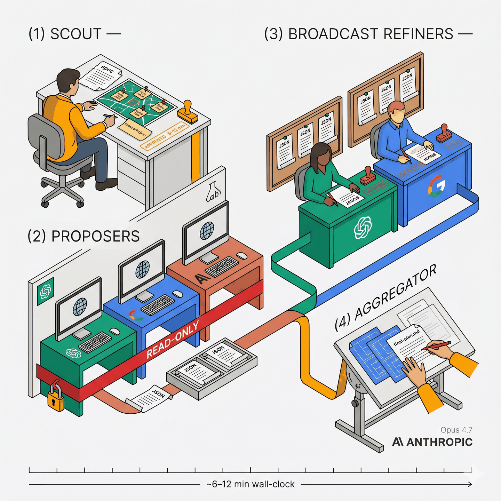

# Architecture

MoA-X is a CLI-native take on the 2024 Mixture-of-Agents method
([Wang et al., arXiv:2406.04692](https://arxiv.org/abs/2406.04692)),
pointed at a different job: producing repo-grounded implementation
plans for coding agents instead of chat answers.

<p align="center">
  
</p>

## The four layers

```
Layer 0 — Scout brief           (parent Claude, in-place)
Layer 1 — Proposers (3 parallel)  codex + gemini + sonnet subprocesses
Layer 2 — Broadcast refiners (2)  codex + gemini, each sees ALL 3 proposals
Layer 3 — Aggregator              (parent Claude Opus, in-place)
```

**Layer 0.** Parent Claude Code session reads your spec, asks 1–3
clarifying questions, writes a scout brief (focus files, in-scope,
out-of-scope). The brief bounds how much exploration the downstream
models do.

**Layer 1: three proposers, three labs.** OpenAI `codex`, Google
`gemini`, Anthropic `claude` (in Sonnet mode). Each produces an
independent plan. Every proposer reads the repo (codex with a
filesystem-enforced read-only sandbox; gemini and sonnet with
read-only enforced by prompt) and does web research. Different labs
tend to mean different training data, different tool-use behavior,
and different blind spots.

**Layer 2: two broadcast refiners.** `codex` and `gemini` each see
all three proposals and produce verification output: which claims
are verified, which are contradicted, what's missing, what the
proposers disagreed on. "Broadcast" means every refiner sees every
proposal, not cross-pair. This is paper-faithful to Wang et al.

**Layer 3: aggregation.** Parent Claude Opus synthesizes into one
plan you can act on. It honors every `contradicted` flag from the
refiners, pulls in every `missing_steps` entry, and surfaces
disagreements instead of silently picking a side.

Layers 0 and 3 live in your Claude Code REPL. Layers 1 and 2 are
subprocesses spawned by `harness/scripts/run_moa.py`.

## Why broadcast refinement

Version 0.1 of this harness used *cross-pair* refinement: codex only
saw gemini's proposal, gemini only saw codex's. That's not what the
MoA paper does. Broadcast (every refiner sees every proposal) costs
the same wall-clock (refiners run in parallel either way) and
gives each refiner enough context to spot cross-proposer
convergence and divergence signals that a one-input view can't
reveal. v0.2 corrected this.

## Why sonnet is proposer-only

Opus 4.x is the Layer 3 aggregator. Sonnet 4.x is a Layer 1 proposer.
Layer 2 is kept to `{codex, gemini}` so the verification step is
done by two labs independent of both:

- the Anthropic-family proposer (Sonnet), and
- the Anthropic-family aggregator (Opus).

Using Sonnet as a refiner would concentrate Anthropic across two
load-bearing layers and reduce verification independence. This
matters when the Anthropic-family proposer is wrong in a way
characteristic of its training: another Anthropic refiner is less
likely to catch it.

## Why these three

Three labs (OpenAI + Google + Anthropic), not more, not fewer.

- **Three is enough for cross-lab diversity.** The paper's own
  ablation shows diversity (different labs) beats quantity (more
  copies of the same model). Three independent labs cover the
  current frontier.
- **Adding more labs costs wall-clock and auth complexity.** Each
  provider needs its own adapter, preflight, and subscription-auth
  story. A fourth provider right now would stretch the codebase
  thin without moving the quality bar much.
- **`{codex, claude-code, gemini}` are a hard architectural constraint,**
  not a TODO. The orchestrator, preflight, and prompt assumptions
  are all shaped around this set. PRs that add providers need a
  design conversation up front. See
  [`CONTRIBUTING.md`](../CONTRIBUTING.md).

## Why subscription-CLI auth

All three providers run on subscription plans via their native CLIs
(`codex`, `gemini`, `claude`), not via API keys and SDKs. Reasons:

- **Predictable cost.** Subscription pricing means you aren't
  rate-limited on a per-token budget in the middle of a run.
- **Subprocess isolation.** Each call runs in its own process group
  with its own TMPDIR. Auth state stays out of the orchestrator
  process's environment.
- **No key material in env vars.** The MoA pipeline never reads
  `ANTHROPIC_API_KEY`, `OPENAI_API_KEY`, or `GEMINI_API_KEY`. If you
  have those set for other tools, that's fine. MoA-X ignores them.

## Why CLI, not SDK

Each vendor CLI already handles auth, retries, tool routing, and
model-specific quirks. An SDK integration would duplicate all of
that inside MoA-X and drift as vendors change their clients. The
CLI surface is more stable and enforces the subscription-auth path
by construction.

## Non-goals

- **Chat-answer benchmarks.** MoA-X is for planning, not Q&A.
- **Eval / benchmark tooling.** Earlier iterations had
  tau-bench/terminal-bench adapters; they're gone.
- **API-key fallback paths.** See subscription rationale above.
- **More than three providers.** See "Why these three" above.
