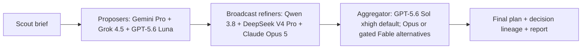

# Architecture

MoA-X adapts the 2024 Mixture-of-Agents method
([Wang et al., arXiv:2406.04692](https://arxiv.org/abs/2406.04692)) to
repo-grounded implementation planning.

```mermaid
flowchart LR
  S["Scout brief"] --> P["Proposers: Gemini Pro + Grok 4.5 + GPT-5.6 Luna"]
  P --> R["Broadcast refiners: Qwen 3.8 + DeepSeek V4 Pro + Claude Opus 5"]
  R --> A["Aggregator: GPT-5.6 Sol xhigh default; Opus or gated Fable alternatives"]
  A --> O["Final plan + decision lineage + report"]
```

## Four layers

**Layer 0: scout.** The parent session turns the request into a bounded scout
brief with focus files, explicit scope, and shared attachment context.

**Layer 1: independent proposals.** Gemini Pro contributes Google-backed web
research, Grok contributes an xAI lane, and GPT-5.6 Luna contributes an
OpenAI planning lane. They run in parallel and cannot see each other's work.

**Layer 2: broadcast refinement.** Qwen, DeepSeek V4 Pro, and Claude Opus each receive
every surviving proposal. They verify claims, identify disagreements, add
missing evidence, and produce structured review output. Broadcast refinement
is paper-faithful and gives every reviewer the same comparison surface.

**Layer 3: decision.** GPT-5.6 Sol at xhigh is the default recorded aggregator.
It consumes only validated upstream artifacts, resolves disagreements without
hiding them, and writes the final Markdown plan plus exact JSON decision
lineage. Claude Opus is an alternative aggregator. Fable is aggregator-only
and warning-gated because it can consume extreme quota.

## Lab diversity and execution harnesses

A route is a `{name, harness, model}` triple:

- `name` is the stable route id and payload `agent_id`;
- `harness` is the local CLI transport (`codex`, `claude`, `opencode`, `agy`,
  or the legacy standalone `gemini` adapter);
- `model` is the exact model id sent to that CLI.

The producing model lab is a separate field. This distinction is
load-bearing: OpenCode executes xAI, DeepSeek, Zhipu, and Alibaba routes but is not
itself a model lab. The Web UI therefore groups and illustrates routes by
`lab_id`, while the provider-health page reports the execution harness used to
reach those labs. The canonical mapping and asset names live in
`harness/scripts/model_labs.py`.

Unknown custom routes receive an `independent` lab identity until their model
prefix can be mapped explicitly. Historical Moonshot, GLM, DeepSeek, Composer,
and Cursor-Grok manifests remain attributable for archive rendering. GLM 5.2
and DeepSeek V4 Pro/Flash are available after live full-schema qualification;
GLM is a Thorough proposer and DeepSeek V4 Pro is a recommended refiner.

## Why this roster

- Gemini Pro enters every recommended mode because its Google-backed web
  search is valuable before refinement.
- Grok enters every mode as an independent xAI proposal lane.
- Balanced adds GPT-5.6 Luna; Thorough adds GPT-5.6 Terra for a deeper OpenAI
  proposer pass without relying on the less reliable retired routes.
- DeepSeek V4 Pro is present in every refinement profile.
- Qwen and Opus join Balanced and Thorough; Opus uses high and max effort,
  respectively.
- The recommended refiners remain lab-independent from the OpenAI aggregator.

The default is intentionally a reliability-weighted ensemble, not a claim
that more lanes are always better. Retained-run evidence showed repeated
incomplete GLM output and schema-invalid DeepSeek output, so both were removed
from the curated surface. DeepSeek V4 Pro later passed the repaired adapter's
full proposer contract on its first attempt. GLM and DeepSeek Flash each
truncated once and passed the single redispatch allowed by the real pipeline.
DeepSeek V4 Pro is now a reliability-weighted default refiner. Kimi K3 remains
attributable in archives but is disabled for new runs after its OpenCode Go
route repeatedly failed before inference.

## OpenCode output handling

OpenCode does not provide a native output-schema flag. MoA-X extracts the
outer JSON object and validates it locally. A root-shaped object that is
missing required fields is retained for validation and repair; a structural
signature prevents nested objects from being promoted as roots. Two failures
are treated differently:

1. Empty or incomplete output with no quota/auth signal receives at most one
   full redispatch.
2. Parseable JSON that fails schema or evidence cross-field validation
   receives one bounded repair pass containing only the invalid object, exact
   error, and schema. The repair runs inside the session directory and must
   not repeat repository or web research.

If repair still fails, the lane fails closed and its invalid output never
enters refinement. Provider quota/auth classification only considers precise
billing signals when no model response was captured, so tool errors such as
oversized grep records cannot masquerade as depleted account balance.

Claude's native schema output can still violate semantic cross-field rules
that JSON Schema does not express. Claude therefore receives the same single
session-confined repair opportunity, with every repository and web tool
disabled during repair.

## Read-only and process isolation

Codex and Claude receive their native structured-output controls. OpenCode
receives an isolated permission config that denies edits and shell access.
AGY requires plan mode plus sandboxing. Every CLI call runs in its own process
group and temporary directory, and the runner rejects workspace mutations
outside the active `.moa` session.

## Why CLI, not SDK

The CLIs already own authentication, provider routing, retries, and
model-specific behavior. MoA-X records the resolved CLI/model/effort in each
manifest instead of duplicating vendor SDKs. Normalized usage and cost
accounting remains a future improvement.

## Non-goals

- chat-answer benchmarking;
- forcing a failed route to pass by weakening schemas;
- treating an execution harness as a model lab;
- committing `.moa` session artifacts.
