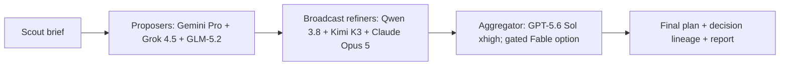

# Architecture

MoA-X is a CLI-native take on the 2024 Mixture-of-Agents method
([Wang et al., arXiv:2406.04692](https://arxiv.org/abs/2406.04692)),
pointed at a different job: producing repo-grounded implementation
plans for coding agents instead of chat answers.


```mermaid
flowchart LR
  S["Scout brief"] --> P["Proposers: Gemini Pro + Grok 4.5 + GLM-5.2"]
  P --> R["Broadcast refiners: Qwen 3.8 + Kimi K3 + Claude Opus 5"]
  R --> A["Aggregator: GPT-5.6 Sol xhigh; gated Fable option"]
  A --> O["Final plan + decision lineage + report"]
```

## The four layers

```
Layer 0 — Scout brief           (parent Claude, in-place)
Layer 1 — Proposers (parallel)    default: Gemini Pro + Grok + GLM
Layer 2 — Broadcast refiners      default: Qwen + Kimi + Opus, each sees ALL proposals
Layer 3 — Aggregator              default: recorded GPT-5.6 Sol at xhigh
```

The roster (which providers run at which layer, and how many) is
config-driven — the defaults shown here are what the harness ships with.

**Layer 0.** Parent Claude Code session reads your spec, asks 1–3
clarifying questions, writes a scout brief (focus files, in-scope,
out-of-scope). The brief bounds how much exploration the downstream
models do.

**Layer 1: proposers across labs.** The default is Google
`agy-gemini-pro`, xAI `grok`, and Zhipu `glm`. Each produces an
independent plan. Every proposer reads the repo
(AGY with plan mode plus sandboxing; OpenCode with a permission-deny policy
plus the prompt rule) and does web research. Different labs tend to mean
different training data, different tool-use behavior, and different blind
spots.

**Layer 2: broadcast refiners.** The default refiners are `qwen` (Alibaba
`qwen3.8-max-preview` through Qwen Token Plan and `opencode`), `kimi`
(Moonshot Kimi K3 through OpenCode Go), and `opus` (Anthropic
`claude-opus-5` at high reasoning). Each sees all the proposals
and produces verification output: which claims are verified,
which are contradicted, what's missing, what the proposers disagreed on.
"Broadcast" means every refiner sees every proposal, not cross-pair. This
is paper-faithful to Wang et al.

**Layer 3: aggregation.** By default the retained synthesis runs through
`--phase layer3 --aggregator-provider codex-sol --aggregator-effort xhigh`,
which invokes `gpt-5.6-sol`, validates
the Markdown and exact decision-lineage pointers, records the subprocess, and
regenerates the report. The aggregator honors contradicted findings, pulls in
missing steps, and surfaces disagreements instead of silently picking a side.

Layer 0 lives in the parent agent. Layers 1 and 2 are subprocesses spawned by
`harness/scripts/run_moa.py`; Layer 3 runs as its own recorded subprocess.

## Why broadcast refinement

Version 0.1 of this harness used *cross-pair* refinement: each refiner
saw only one other proposer's plan. That's not what the
MoA paper does. Broadcast (every refiner sees every proposal) costs
the same wall-clock (refiners run in parallel either way) and
gives each refiner enough context to spot cross-proposer
convergence and divergence signals that a one-input view can't
reveal. v0.2 corrected this.

## Why each default lane uses a different lab

Gemini Pro, Grok, and GLM propose; Qwen, Kimi K3, and Claude Opus review;
GPT-5.6 Sol aggregates. No lab authors more than one default lane. This keeps
the aggregator from seeing an upstream plan from its own family and prevents
Opus from reviewing a Sonnet proposal. Thorough adds DeepSeek V4 Pro as a
fourth proposer without introducing a repeated lab.

## Why this roster

The default roster spans seven labs — Google (`agy-gemini-pro`), xAI
(`grok`), Zhipu (`glm`), Alibaba (`qwen`), Moonshot (`kimi`), Anthropic
(`opus`), and OpenAI (`codex-sol`).

- **Cross-lab diversity beats quantity.** The paper's own ablation
  shows diversity (different labs) beats more copies of the same model.
  Seven independent labs cover more of the current frontier and avoid
  repeating one vendor at multiple decision stages.
- **Adding lanes costs wall-clock and auth complexity.** Each provider
  needs an auth story (subscription OAuth or an API key) and adds to the
  parallel fan-out, though the wall-clock cost is bounded since layers
  run in parallel.
- **It's a default, not a cap.** The roster is pure config (see
  [`config.md`](config.md)); Qwen Token Plan ships in the default refiner set,
  while DeepSeek V4 Pro/Flash are curated OpenCode Go routes.
  Tested recipes for MiniMax, xAI Grok, Mistral, or other frontier models are
  welcome. Most should slot into the existing `opencode`
  or `cursor` adapter. A genuinely new *harness* still needs its own adapter,
  preflight, and prompt-assumption review, so open an issue first. See
  [`CONTRIBUTING.md`](../CONTRIBUTING.md).

### Why Google is a default proposer

Gemini Pro supplies the Google-backed research lane in every recommended
planning depth. It reuses the authenticated local Antigravity account and
requires plan mode plus sandboxing. Live AGY probes fail closed unless the Pro
route is currently available. See
[`config.md`](config.md#google-models-through-agy).

### Why provider names instead of fixed roles

A provider in moa-x is a `{name, harness, model}` triple. The `harness`
is which CLI gets invoked (`codex`, `claude`, `opencode`, `cursor`, or `agy`); the
`model` is what that harness asks for (e.g. `gpt-5.6-terra`, `opencode-go/glm-5.2`,
`cursor-grok-4.5-high`); the `name` is a stable route identifier that becomes
the `agent_id` in payloads. Compatibility names remain stable even when their
resolved model advances; the Web UI presents the canonical model label. The
curated surface ships `codex`, `codex-sol`, `codex-luna`, `sonnet`, `opus`,
`glm`, `kimi`, `qwen`, `qwen-opencode`, `composer`, `grok`, `cursor-grok`,
`deepseek`, `deepseek-flash`, and `agy-gemini-pro`. The two DeepSeek
routes resolve to OpenCode Go's current V4 Pro and V4 Flash model ids and can
participate as proposers or refiners. Legacy `codex-reviewer` and
`codex-aggregator` names remain resolvable for existing configs but are hidden
from the Web UI. Users add their own under
`providers:` in `harness/config.yaml` or via the
`MOA_PROVIDER_<NAME>=<harness>:<model>` env shorthand.

This split exists because the Cursor CLI breaks the one-CLI-one-lab
assumption — `cursor-agent --model gpt-5.6-sol-high` and
`codex --model gpt-5.6-terra`
both hit OpenAI. Encoding the lab in the harness identifier would
have meant pretending Cursor was three or four different harnesses;
splitting the data model is cleaner.

The lab-independence preference (Layer 2 refiners should not share a
lab with the GPT-5.6 Sol aggregator) lives in CLAUDE.md as a recommendation,
not as a runtime invariant. The harness stays lab-agnostic; the user
decides whether the soft rule is worth following.

## Why CLI, not SDK

Each vendor CLI already handles auth, retries, tool routing, and
model-specific quirks. An SDK integration would duplicate all of
that inside MoA-X and drift as vendors change their clients. The
CLI surface is also more stable, and it lets the orchestrator stay
agnostic to how the user is billed: whatever auth the CLI is in
when invoked (subscription OAuth, keychain, or `*_API_KEY` env
var) is the auth MoA-X uses. Each CLI call also runs in its own
process group with its own TMPDIR, so auth state stays out of the
orchestrator process's environment.

API-key authentication already works through the underlying CLIs. Normalized
usage/cost accounting in the manifest and report, plus safe pre-dispatch budget
controls, remains an open direction. See the top-level README's contribution
priorities.

## Non-goals

- **Chat-answer benchmarks.** MoA-X is for planning, not Q&A.
- **Eval / benchmark tooling.** Earlier iterations had
  tau-bench/terminal-bench adapters; they're gone.

Previously this list also called "API-key fallback" and "more than
three providers" non-goals. Neither is anymore. The underlying CLIs support
subscription and/or API-key auth, the default roster spans four labs, Qwen is
a built-in default refiner, and the roster is user config. The one constraint we
still recommend (not enforce) is lab-independence at refinement and
aggregation (see "Why Anthropic moved into proposal and review" above); the shipped
default honors it and the orchestrator warns when a roster breaks it.
